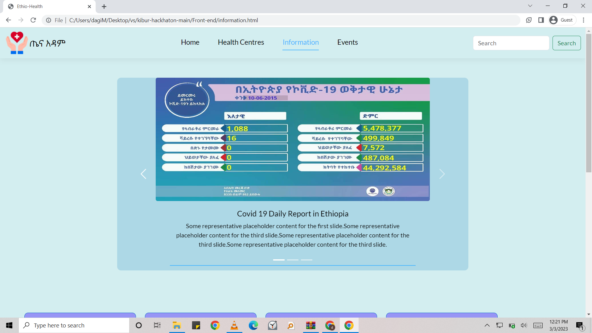
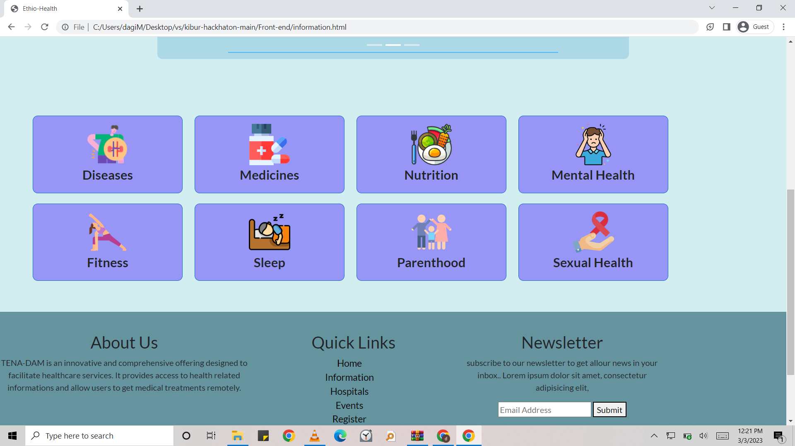
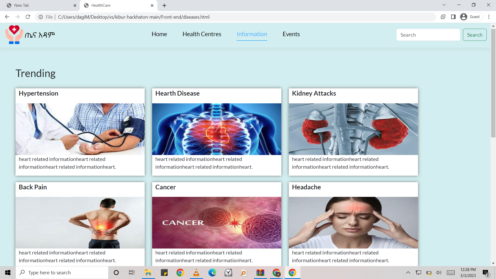
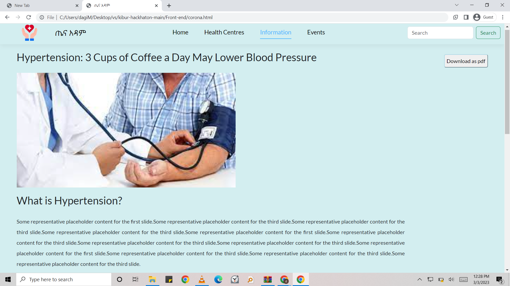
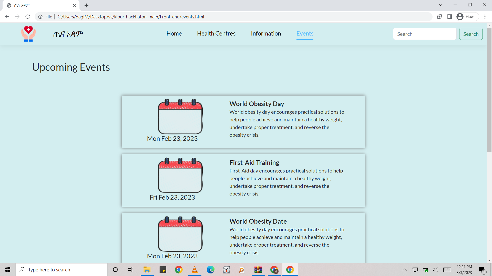

# TenaAdam 

**TenaAdam** is a comprehensive health information platform developed during a 24 hours long hackathon. It offers users valuable resources on various health-related topics, including diseases, foods, medicines, nutrition, and more. The platform also features tools for locating nearby health centers and provides detailed information about them. Additionally, TenaAdam keeps users informed about upcoming health-related events.

## Features

- **Health Information**: Access a wide range of information on diseases, foods, medicines, and nutrition. Each topic is presented with detailed explanations and practical tips.

- **Find Nearby Health Centers**: Easily locate health centers near you with our integrated map feature. Each center is accompanied by detailed information, including services offered, contact details, and operating hours.

- **Health Events**: Stay updated with upcoming health-related events such as seminars, workshops, and wellness programs. 

## Technologies Used: *HTML*, *CSS*, *JavaScript*

<table>
  <tr>
  </tr>
  <tr>
    <td></td>
    <td></td>
  </tr>

  <tr>
    <td></td>
    <td></td>
  </tr>
  

  <tr>
    <td></td>
  </tr>
  
  <tr>
    <td></td>
    <td></td>
  </tr>
  
  <tr>
    <td></td>
  </tr>
        
 </table>
 
